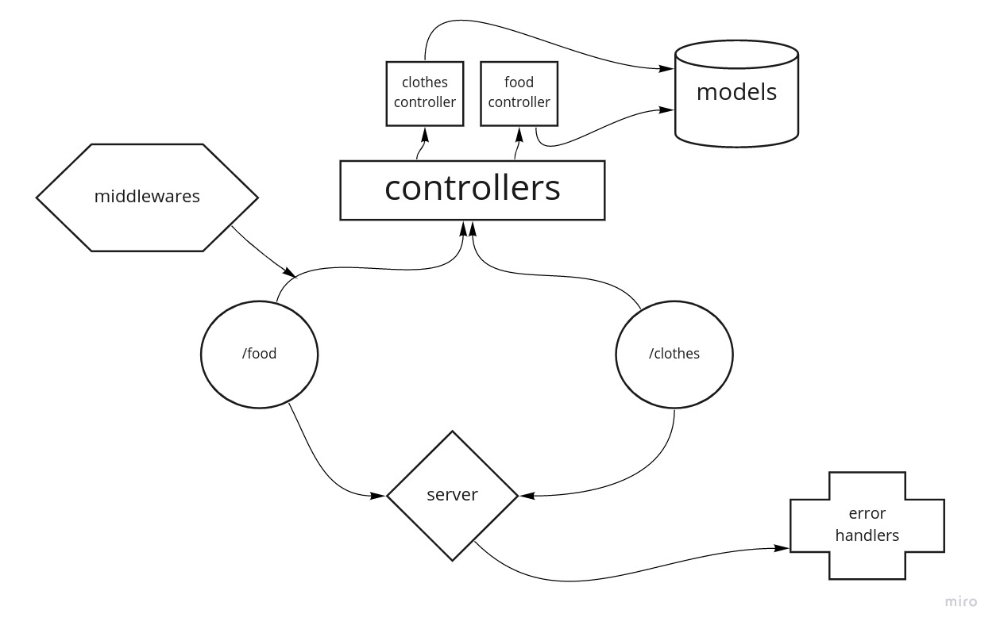

# basic-api-server

[heruku app Url](https://ahmad-basic-api-server.herokuapp.com/)

[dev branch deployed link](https://github.com/ahmadammmoura/basic-api-server/tree/dev)

[action link](https://github.com/ahmadammmoura/basic-api-server/actions)

### UML

